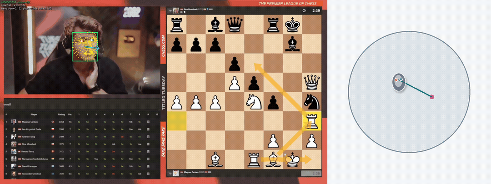

<h1 align="center">chess-gaze</h1>

<p align="center">Turns a chess stream video into gaze estimates and a local 3D viewer:</p>

<p align="center">
  
</p>

## Video-to-gaze pipeline

When you run `chess-gaze analyze <video>`, it:

1. Decodes the video.
2. Finds the face, eyes, and head pose with MediaPipe.
3. Builds UniGaze inputs with the default precision profile: expanded face
   framing, ImageNet normalization, and persisted preprocessing metadata.
4. Runs [UniGaze](https://github.com/ut-vision/UniGaze) from local weights.
5. Writes calibration metadata and per-frame records with head pose, gaze
   angles, gaze rays, and projection metadata.
6. Projects gaze rays onto the 3D gaze sphere and, when configured, a calibrated
   screen or board target plane.
7. Builds a local browser viewer.

See [the demo](https://artemlegotin.com/chess-gaze-demo).

## Run the analyzer

```sh
uv sync
```

Download the model files and put them here:

| Local path | Source |
| --- | --- |
| `models/mediapipe/face_landmarker.task` | [MediaPipe Face Landmarker model bundle](https://storage.googleapis.com/mediapipe-models/face_landmarker/face_landmarker/float16/latest/face_landmarker.task) |
| `models/unigaze/unigaze_h14_joint.safetensors` | [UniGaze `unigaze_h14_joint.safetensors`](https://huggingface.co/UniGaze/UniGaze-models/blob/main/unigaze_h14_joint.safetensors) |

Analyze a video:

```sh
uv run chess-gaze analyze artifacts/input/test_1.mp4
```

Keep processed overlays for review:

```sh
uv run chess-gaze analyze artifacts/input/test_1.mp4 --save-frames
```

Open the printed `viewer/index.html`, or serve the viewer on localhost:

```sh
uv run chess-gaze view artifacts/output/<video-stem>/runs/<run-id>
```

Default inference expects Apple Silicon MPS, UniGaze batch size `7`, and the
precision preprocessing profile. For a portable CPU run:

```sh
uv run chess-gaze analyze video.mp4 --unigaze-device cpu --unigaze-batch-size 1
```

## Analysis artifacts

Runs land here:

```text
artifacts/output/<video-stem>/runs/<run-id>/
```

Core outputs:

- `calibration.json`: analysis settings, UniGaze preprocessing metadata, and
  optional target-plane geometry.
- `records/frames.jsonl`: face, eye, head pose, UniGaze yaw/pitch, and frame
  errors.
- `records/scene_frames.jsonl`: eye points, gaze ray, sphere hit, and optional
  calibrated target-plane hit.
- `viewer/index.html`: direct-open 3D viewer with embedded scene data.
- `viewer/scene-data.json`: viewer data for the local server path.
- Processed frame JPEGs (if `--save-frames` added).

## Inspect the gaze scene

The viewer shows a head model, eyes, the UniGaze ray, a gaze sphere, and
translucent hit-area patches. If the run has target-plane calibration, the
viewer also shows the configured screen or board plane and the current
plane-hit marker. Scrub frames, play the run, switch instant or accumulated
hits, and adjust display assumptions such as sphere radius and angular error.

Run artifacts stay local. The viewer loads pinned Three.js `0.185.0` modules from jsDelivr when it renders.

## Runtime stack

Python 3.12, `uv`, PyAV, MediaPipe Face Landmarker, UniGaze, PyTorch, OpenCV, Pydantic, Pillow, and Three.js.

## Development checks

```sh
uv run pytest
uv run ruff check .
uv run ruff format --check .
uv run mypy
```
